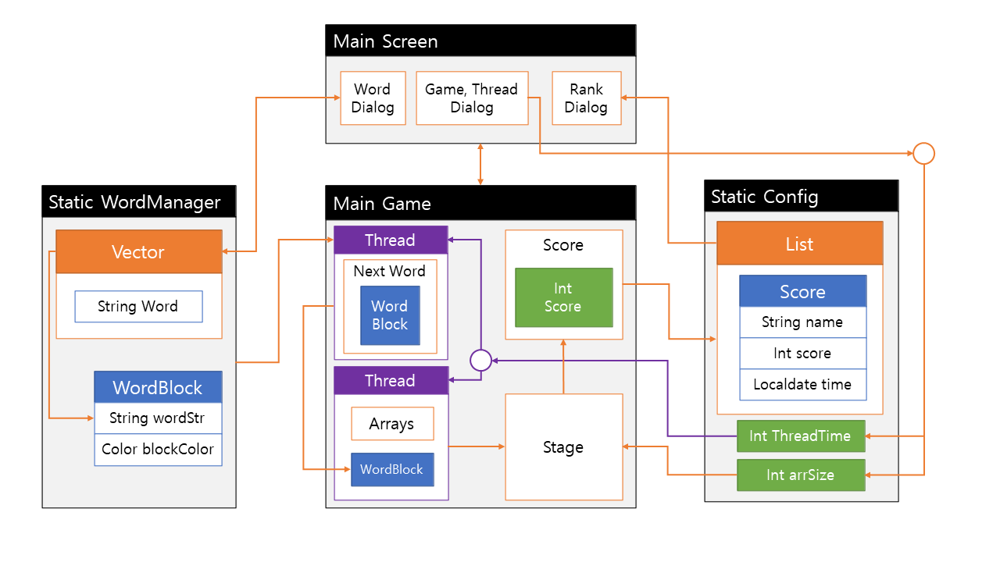

# OOP2_Blocks
21-2 객체지향언어2 기말 프로젝트

## 개요
테트리스와 단어 타이핑을 합친 게임이다. 가로 N칸 세로 N칸의 필드가 주어진다. 게임이 시작하면 단어의 길이 만큼의 가로 길이와 세로 길이 1을 차지하는 단어 블록이 떨어진다.

단어 블록은 시간 마다 한 칸씩 아래로 떨어지며 사용자는 단어가 다른 블록에 닿아 전까지 해당 블록을 배치 혹은 삭제할지를 결정한다.

배치모드 상태로 떨어지는 단어를 입력하면 점수가 주어지고, 키보드 좌우 버튼으로 단어의 위치를 이동시킬 수 있다. 

삭제모드 상태로 떨어지는 단어를 입력하면 해당 단어를 파괴시키거나 배치되어 있는 블록을 파괴시킬 수 있다. 삭제모드로는 점수를 얻을 수 없다.

사용자가 시간내에 단어를 입력하지 못하여 단어 블록이 땅에 닿는다면 다음 단어가 등장한다. 이렇게 시간내에 입력하지 못하여 자동으로 배치된 단어는 삭제모드로 제거할 수 없다. 해당 라인은 가로로 한 줄로 채워야 삭제시킬 수 있다.

테트리스와 동일하게 단어 블록이 가로 한 줄을 채운다면 추가 점수를 받고 해당 라인을 삭제시킨다. 사용자는 삭제와 배치 모드를 적절하게 사용하여 높은 점수를 기록하여야 한다.

## 구조도

대충 만듦
